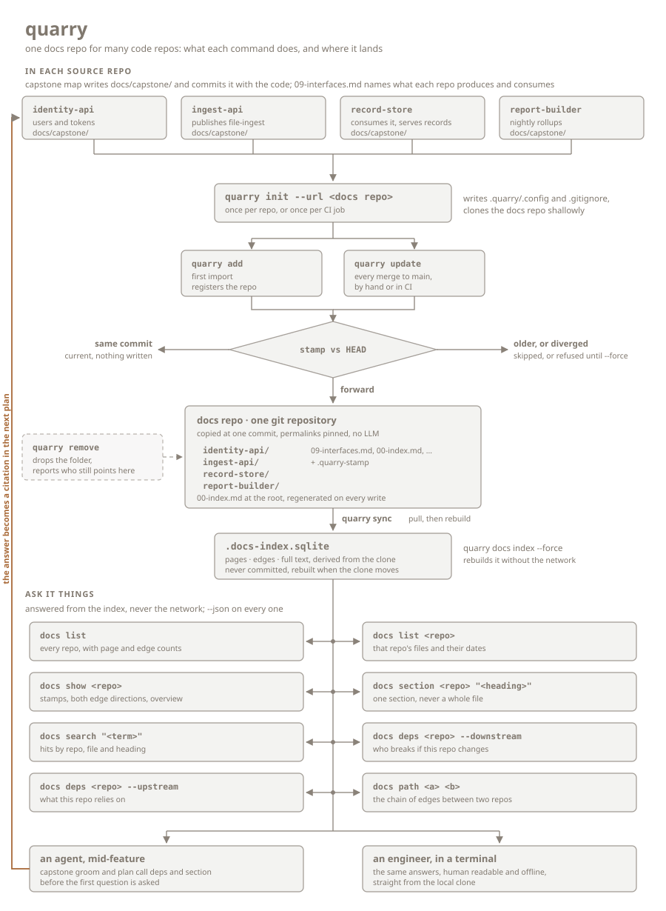

<p align="center">
  
</p>

<p align="center">
  <strong>One face for every repo.</strong><br>
  Everything, in its right place.
</p>

<p align="center">
  <a href="https://github.com/GentBajko/capstone"></a>
  <a href="#install"></a>
  
  <a href="LICENSE"></a>
</p>

<p align="center">
  <a href="https://www.patreon.com/cw/GentBajko"></a>
  <a href="https://buymeacoffee.com/gentbajko"></a>
</p>

<p align="center">
  <a href="https://github.com/GentBajko/capstone">Capstone</a> documents each repo in place, beside the code
  it describes. quarry copies those references into a single git repository
  and indexes them. What comes back is the answer that spans repos: who consumes what
  this one produces, what breaks if it changes, what a contract actually
  says. quarry writes no documentation and runs no model.
</p>

<p align="center">
  
</p>

<p align="center">
  <a href="#install">Install</a> ·
  <a href="#use-it">Use it</a> ·
  <a href="#in-ci">In CI</a> ·
  <a href="#cross-repo-edges">Edges</a> ·
  <a href="#contract-check">Contracts</a> ·
  <a href="#commands">Commands</a> ·
  <a href="#rules-worth-knowing">Rules</a> ·
  <a href="#with-capstone">With Capstone</a>
</p>

---

## Install

### Step 1: give your repos something worth copying

**quarry writes no documentation.** It copies and indexes; every page it
serves was generated somewhere else. Use
**[Capstone](https://github.com/GentBajko/capstone)** to produce them.
Same author, same licence, and the tool quarry was built against.

```text
/plugin marketplace add GentBajko/capstone     # Claude Code
/plugin install capstone@capstone-marketplace
```

```bash
gh skill install GentBajko/capstone --all --agent github-copilot   # Copilot
npx skills add GentBajko/capstone                                  # 70+ other agents
```

Then `/capstone:map` in each repo, which reads the code and writes
`docs/capstone/`: an index, numbered chapters, the business logic scenario
by scenario, and `09-interfaces.md`, the chapter that declares what the
repo produces and consumes. That last one is what makes `deps` and `path`
work at all.

This is not decoration. quarry's requirements *are* [Capstone](https://github.com/GentBajko/capstone)'s output
shape: `quarry add` refuses a repo with no `00-index.md`, every result's
date comes from a `generated_date` stamp, and edges come from the
interfaces chapter. Anything else works only if you reproduce that shape
by hand.

### Step 2: install quarry

A single static binary. No runtime, no `cargo`, nothing to keep running.

```sh
curl -LsSf https://github.com/GentBajko/quarry/releases/latest/download/quarry-installer.sh | sh
```

Windows:

```powershell
irm https://github.com/GentBajko/quarry/releases/latest/download/quarry-installer.ps1 | iex
```

Rust users can take `cargo binstall quarry`; anyone else can grab the
archive for their platform off the releases page. Building it yourself is
`cargo build --release`.

The only requirement is `git` 2.30 or newer on `PATH`. quarry drives the
git binary, so the credentials and proxy settings it uses are the ones
you already configured. SQLite is compiled in.

## Use it

Five commands run in a source repo, once each in the places you'd expect:

```sh
quarry init --url git@github.com:acme/docs-quarry.git   # once per repo
quarry add                                             # register and import
quarry update                                          # after every merge to main
quarry sync                                            # pull what other repos pushed
quarry check                                           # before merging: are consumers' fields still produced
```

Eight answer questions, from the local index, offline, with `--json` on
every one:

```sh
quarry docs list                                    # every repo, with page and edge counts
quarry docs list record-store                       # one repo's files and their dates
quarry docs show record-store                       # stamps, both edge directions, overview
quarry docs section record-store "file-ingest (v2)" # one section, never a whole file
quarry docs search "file-ingest" --repo record-store
quarry docs deps ingest-api --downstream --depth 2  # who breaks if this changes
quarry docs deps report-builder --upstream          # what this repo relies on
quarry docs path ingest-api report-builder          # the chain between two repos
```

What that last group is for:

```text
$ quarry docs deps ingest-api --downstream --depth 0
ingest-api
  sqs file-ingest -> record-store
    http GET /records -> report-builder
2 repos, depth 2

$ quarry docs section record-store "file-ingest (v2)"
record-store/09-interfaces.md § file-ingest (v2)   2026-09-03

| Field        | Type          | Required | Notes                                     |
|--------------|---------------|----------|-------------------------------------------|
| file_id      | string (uuid) | yes      |                                           |
| content_type | enum          | yes      | accepted: application/json, application/xml |
```

Two calls, and the CSV parser nobody has written yet already has a
constraint attached to it: `content_type` is an enum without CSV, and it
lives in a repo you were not going to open.

## In CI

```yaml
on:
  push:
    branches: [main]
jobs:
  quarry:
    runs-on: ubuntu-latest
    steps:
      - uses: actions/checkout@v4
      - run: curl -LsSf https://github.com/GentBajko/quarry/releases/download/v0.1.0/quarry-installer.sh | sh
      - run: quarry init --url ${{ vars.QUARRY_DOCS_REPO }}
      - run: quarry update
```

Pin the installer to a tag rather than `latest`, so two hundred workflows
do not all move the day a release ships. `quarry init` is a no-op when
`.quarry/.config` is committed, which is the normal case.

Add `--strict` to `quarry update` to fail the job when a declared `Site`
path is not in the tree at that commit.

On pull requests, add a second job that runs `quarry init` and then
`quarry check`; it needs the clone and nothing else, and exits 1 on a
contract break (see [Contract check](#contract-check)).

## Cross-repo edges

Edges come from each repo's own `09-interfaces.md`, written as tables:

```markdown
## Produces

| Kind | Name | To | Site |
|---|---|---|---|
| sqs | file-ingest | [record-store](../record-store/09-interfaces.md) | `src/publish.rs:57` |

## Consumes

| Kind | Name | From |
|---|---|---|
| http | GET /users/{id} | [identity-api](../identity-api/09-interfaces.md) |
```

Columns are matched by name, not position, so a renamed column is a
warning rather than a silent zero. Backticks and link syntax are stripped
from cells, which means the relative link that gives you a graph in any
markdown viewer is the same cell the repo name comes from. Tables are read
only on that page and never inside a fenced block, so a document
describing this format declares nothing.

Frontmatter does the same job on any page, for generators that would
rather emit data than markdown, and wins when a page carries both:

```yaml
produces:
  - kind: sqs
    name: file-ingest
    to: record-store
    site: src/publish.rs:57
```

`kind` is free-form and lowercased; `name` and `to`/`from` are required.
Either side may declare an edge, and when both do quarry reports
`declared_by: both`. A disagreement between the two stays visible instead
of being merged away. An edge pointing at a repo that is not in the docs
repo is kept and marked `(not in quarry)`, so a broken link is something
you can see. Repos declaring no edges at all are still fully searchable.

`site` is optional and checked at import. The path part of every `Site`,
everything before a trailing `:line` or `:from-to`, is tested against the
imported commit's tracked files. A miss does not stop the import: the page
lands, the output carries a note such as
`site src/gone.rs:12 for http GET /records is not in the tree at 4f1c9a2`,
the folder's stamp records the edge under `unverified`, and `deps` marks
it `(site unverified)` from either end until a later import verifies it.
`add --strict` and `update --strict` refuse instead, listing every
unverifiable site, and write nothing. A chapter whose frontmatter carries
`mode: prescriptive` names planned paths. Its sites are skipped: nothing
is noted or stamped, and `--strict` does not refuse on it.

The join key is the folder name, the last segment of the origin URL, and
the consumer's code usually knows a hostname or a compose service name
instead. A producer can list what it is called:

```yaml
known_as: [records.internal, records-service, records-svc]
```

on any of its pages, and Capstone writes it into `09-interfaces.md` from
the deploy config. A `to`/`from` cell resolves against the exact folder
name first, then case-insensitively, then through those aliases. An edge
that resolved through an alias keeps the string as written in
`as_declared` and prints `(declared as records-svc)`, so the disagreement
stays visible. An alias two repos claim is ignored with a warning, and
`quarry docs index` lists every target that resolved to nothing with the
nearest registered names beside it.

A producer that cannot name its callers writes `to: unknown`. That row is
a publication: counted, searchable, shown by `docs show` as `-> (unknown)`,
and never an edge. `docs deps --downstream` then appends repos whose
interfaces page mentions the name, marked `(by name only)`. Treat that
list as a lead and confirm it before acting on it.

### Observed edges

Declared edges are what the model wrote down. Traffic is what happened.
An optional `observed-edges.json` at the docs repo root brings the two
together:

```json
{
  "generated_at": "2026-09-05",
  "edges": [
    {"from": "record-store", "to": "report-builder", "kind": "http", "name": "GET /records", "last_seen": "2026-09-05"}
  ]
}
```

One row per caller, callee and route. `from` and `to` are repo names, or
any `known_as` alias a repo declares, and resolve the same way declared
edges do; a name nothing resolves is a warning in `quarry docs index` and
the row is skipped. `kind` is lowercased and, with `name`, forms the edge
key: a row whose `kind` or `name` differs from the page's becomes an edge
of its own, so `rest` where the page says `http` costs you a second edge.
`last_seen` and `generated_at` are optional; when a route appears twice
the later `last_seen` wins.

Who writes the file is up to you: a gateway log job, a service mesh
export, an OpenTelemetry query. quarry only reads it. Commit it to the
docs repo like any other page; `sync` discards untracked files in the
clone, and the index rebuilds when the docs repo's `HEAD` moves.

With the file present, `deps` and `show` say which edges traffic backs
up:

```text
$ quarry docs deps record-store --downstream
record-store
  http GET /records -> report-builder
  http GET /health -> monitor (observed, undeclared)
  grpc Lookup -> search-api (declared, never observed)
3 repos, depth 1
```

An edge no page declares is indexed with `declared_by: observed` and
walked like any other. `--json` adds `observed: true|false` on every
edge and `last_seen` where traffic carried a date, plus `observed_file`
on the result, so a consumer can tell "never observed" from "no file".
`quarry docs index` reports `observed edges: 12 (generated 2026-09-05)`
while the file exists. A file that does not parse costs one warning; the
index still builds.

This is the one way an empty `deps` result becomes evidence rather than
absence. It still cannot see a consumer that was never registered, so
the coverage job in
[`templates/quarry-audit.yml`](templates/quarry-audit.yml) compares
`gh repo list` with the folders in the docs repo once a night and prints
the repos with no folder.

## Contract check

`09-interfaces.md` carries one `### <Name>` section per edge row, under
`## Produces` for what this repo emits and under `## Consumes` for the
fields this repo actually reads:

```markdown
## Produces

| Kind | Name | To |
|---|---|---|
| http | GET /records | [report-builder](../report-builder/09-interfaces.md) |

### GET /records

| Field | Type | Required |
|---|---|---|
| id | string | yes |
| created_at | string | yes |
| content_type | enum | yes |
```

`quarry check` reads the working tree's chapter, finds every consumer the
quarry knows for each produced contract, and compares the two tables field
by field:

```text
$ quarry check
record-store produces http GET /records
  report-builder reads id, created_at, content_type   (2026-09-01)
  break: content_type no longer produced
1 break
```

| The consumer reads a field that | Verdict |
| --- | --- |
| the producer no longer lists | break |
| changed type | break |
| flipped between required and optional | warning |

A break exits 1; warnings and notes never do. `--json` keeps `ok: true`
and puts the list under `result.breaks`, one object per consumer and
field. A producer row with no payload section is a warning ("nothing to
compare"); a consumer with no section for the contract is a note.
Headings match exactly first, then with a version suffix
(`### file-ingest (v2)` satisfies `file-ingest`); columns are matched by
name; `Required` reads `yes`/`no`, and a table without the column is
compared on field and type only; types are compared after trimming and
case-folding.

The check is offline: it uses the clone as last synced, so in CI it runs
right after `quarry init`, on pull requests, beside Capstone's `map check`,
and blocks the merge before a consumer ever sees the change. `quarry
update` runs the same comparison after every import and reports breaks as
notes without changing its exit code.

## Commands

**In a source repo**

| Command | What it does |
| --- | --- |
| `quarry init [--url] [--docs-dir] [--default-branch] [--name] [--force]` | Link this repo to a docs repo, write `.quarry/`, clone it shallowly. `--name <target> --docs-dir <dir>` registers one monorepo target, one call per target. `--force` relinks to a different docs repo |
| `quarry add [--strict]` | Register this repo in the docs repo and import its docs. Running it twice is a no-op. `--strict` refuses when a declared site is not in the tree |
| `quarry update [--force] [--strict]` | Copy the docs at `HEAD` into the docs repo, commit, push. `--force` imports over a diverged or unreachable stamp; `--strict` refuses when a declared site is not in the tree |
| `quarry sync` | Pull the docs repo clone, then rebuild the index |
| `quarry remove` | Drop this repo's folder, reporting who still declares edges to it |
| `quarry check` | Compare every produced contract's payload table with the fields each consumer records; exit 1 on a break |

**Queries**

| Command | What it answers |
| --- | --- |
| `quarry docs list [<repo>]` | Every repo with its page and edge counts, or one repo's files. `--json` adds each repo's `known_as` list |
| `quarry docs show <repo>` | Stamps, aliases, both edge directions, publications with unknown consumers, and the repo's overview section. Edge lines carry the same observed marks as `deps` |
| `quarry docs section <repo> "<heading>"` | One section by heading. Exact match first, then prefix; an ambiguous heading lists the candidates and exits 1 |
| `quarry docs search "<term>" [--repo] [--limit]` | Full-text hits by repo, file and heading |
| `quarry docs deps <repo> --downstream\|--upstream [--depth N]` | The edge walk. `--depth 0` is unlimited; cycles are marked once and not expanded. Publications add possible consumers `(by name only)`; with `observed-edges.json` present, edges are marked `(observed, undeclared)` or `(declared, never observed)` |
| `quarry docs path <a> <b>` | The shortest chain of edges, falling back to the reverse direction |
| `quarry docs index [--force]` | Rebuild the local index without touching the network, listing every edge target that resolved to nothing and, when `observed-edges.json` is there, the `observed edges:` count and its generation date |

Every command takes `--json` and prints exactly one JSON document,
including on failure. Add `--verbose` to see each git command on stderr.

## Rules worth knowing

**Only commits reachable from the default branch are imported.** The docs
repo stays a function of what actually shipped, and branch previews live
in the source repo where you already have them.

**The imported commit is stamped, with the origin and the docs folder it
came from.** Re-importing the same commit does
nothing; an older commit is skipped; a diverged history is refused until
`--force`. On a shallow CI checkout quarry fetches the stamp commit rather
than guessing.

**Two writers never corrupt the docs repo.** A person and a CI job racing
on the same repo both end at the newer commit. A rejected push discards
the local commit, resets to the remote and redoes the copy, up to three
times. That is safe because an import is a pure function of
`(repo, commit)`: two machines produce identical bytes.

**Queries never touch the network.** The index rebuilds whenever the clone
moves; `sync` is the only read-side command that pulls. A clone unsynced
for a day says so before it answers.

**Declared sites are checked at import.** A `Site` whose path is not in
the tree at the imported commit is noted in the output and recorded in the
stamp, and `deps` marks the edge from then on. `--strict` turns the note
into a refusal.

Exit codes: `0` answered or nothing to do, `1` refused or a contract
break, `2` something external failed.

## With [Capstone](https://github.com/GentBajko/capstone)

The two halves are meant to be run together, and the split between them is
the whole design. [Capstone](https://github.com/GentBajko/capstone) reads code with a
model and writes each repo's docs in place. quarry copies those pages at
one commit, indexes them, and answers — no model, no service, nothing to
keep running. Generation and distribution never mix, which is why an
import is deterministic enough for two machines to race on it.

What that buys you is one repo reaching for another repo's contract
**before writing code**. [Capstone](https://github.com/GentBajko/capstone)'s `groom` and `plan` call
`quarry docs deps` and `quarry docs section` when a feature touches paths
covered by `09-interfaces.md` — by workspace name in a monorepo, which is
the target name here. The constraint lands in the plan as a
citation, rather than in code review a week later. Set
`cross_repo: "off"` in `capstone.json` if you'd rather it didn't.

The other direction is `quarry check`: Capstone 6.2 writes a payload table
under every Produces and Consumes row, and the producer's CI compares its
own against each consumer's before the change merges.

Designing something new works the same way. A repo with no origin, no
commits and no docs can still run `quarry init` and read the whole quarry;
registration is only needed to *contribute*. So the architecture and stack
interviews can ask what already runs here and get an answer instead of a
guess. An internal service that already does the job is a dependency you
never take.

Without [Capstone](https://github.com/GentBajko/capstone), quarry still runs: point it at any `docs/` folder
that carries `00-index.md` and `generated_date` stamps, and declare edges
with the two frontmatter keys above. You will be hand-maintaining the
shape [Capstone](https://github.com/GentBajko/capstone) produces for free.

---

<details>
<summary>What lands where</summary>

```text
<source repo>/.quarry/
  .config              docs repo URL, docs folder, default branch
  .gitignore           ignores the clone and the index
  <docs-repo>/         shallow clone; the commits inside it are quarry's
  .docs-index.sqlite   derived, never committed, rebuilt when the clone moves
```

Commit `.quarry/.config` and `.quarry/.gitignore`; everything else is
local and disposable. `init` writes nothing outside `.quarry/`.

The docs repo itself is one folder per repo, plus a root `00-index.md`
regenerated on every write:

```text
docs-quarry/
  00-index.md
  observed-edges.json  optional, written by your traffic exporter (see Observed edges)
  ingest-api/
    .quarry-stamp        the imported commit, origin, docs folder, and any edges whose site was not in the tree
    00-index.md, 01-architecture.md, …, 09-interfaces.md, logic/
  record-store/
  …
```

`file:line` pointers in the copied pages are rewritten into permalinks
pinned to the imported commit, so a link stays true after the code moves.
GitHub and GitLab shapes are built in; anything else uses the GitHub shape
unless `.quarry/.config` carries a `permalink_template` with `{owner}`,
`{repo}`, `{sha}`, `{path}` and `{line}`.

</details>

<details>
<summary>Configuration</summary>

`.quarry/.config`, written by `init`:

```json
{
  "default_branch": "main",
  "docs_dir": "docs/capstone",
  "permalink_template": null,
  "targets": [{"name": "billing", "docs_dir": "services/billing/docs/capstone"}],
  "url": "git@github.com:acme/docs-quarry.git"
}
```

`targets` is absent until `init --name` writes it.

`QUARRY_DOCS_REPO`, `QUARRY_DOCS_DIR` and `QUARRY_DEFAULT_BRANCH` stand in
for `--url`, `--docs-dir` and `--default-branch` when there is no config
yet, which is what makes a fresh CI runner work. Precedence is flag, then
environment, then the file, then what quarry can work out for itself.

`default_branch` is the branch `update` imports from, and it is the one
setting quarry guesses. It reads `origin/HEAD`, asks the remote when that
is unset, and only then falls back to whichever of `main`, `master`,
`trunk` or `develop` actually has a ref. Pass `--default-branch` once if
your repo uses something else; a stored value survives every later `init`,
including the one your CI runs on every job.

The repo's name in the docs repo is the last path segment of its `origin`
URL and is not configurable; a monorepo target's folder is its target
name. Two folders claiming one name are refused, on the strength of the
origin and docs folder recorded in the stamp. Other names a repo answers
to go in a `known_as` list in its own pages; they are resolved at index
time and never change the folder name.

</details>

<details>
<summary>Monorepos</summary>

One repository can hold several documented workspaces. Register each one
once:

```sh
quarry init --url git@github.com:acme/docs-quarry.git \
  --name billing --docs-dir services/billing/docs/capstone
quarry init --name orders --docs-dir services/orders/docs/capstone
```

`add`, `update`, `remove` and `check` then walk every target. Each lands
as its own folder in the docs repo, named after the target, with its own
stamp; edges between two targets of one repo are ordinary edges. When the
root `docs_dir` holds a `00-index.md` (Capstone's index-of-indexes), it is
imported too, under the repo's own name, with every link into a target's
docs folder rewritten to `../<target>/…`. Registering a target rewrites
those links on the next run, without waiting for a new source commit. One
`update` is one commit (`update billing, orders, acme-app @4f1c9a2`); with
targets configured, `--json add`, `update` and `remove` return an array
with one block per folder they touched, `--json check` names the producing
target on every contract and break row, and `--json init` lists the
registered `targets`. Capstone names its workspaces the same way, so
`groom` and `plan` query quarry by target name.

A target name is one path segment, and not `00-index.md` or
`observed-edges.json`, which the docs repo root already owns. Its docs
folder is validated like the root one, and both are rechecked on every
run, so a hand-edited `.quarry/.config` is refused before anything is
written. Two targets may not share a name or a docs folder, and one
target's docs folder may not sit inside another's; a target's folder
inside the root `docs_dir` is fine, and the umbrella import skips it.

</details>

<details>
<summary>Rough edges</summary>

Retrieval is SQLite FTS5 over the copied markdown. That is quick at a few
thousand pages and untested at fifty thousand; the rebuild budget is one
marked test, at ten seconds for five thousand pages.

The docs repo has no CI of its own by design, so nothing garbage-collects
a repo that stops pushing. Its folder simply keeps its last stamp, and
`quarry docs list` shows the date going stale.

Windows is built and tested but thin in the field. macOS and Linux are the
ones in daily use.

quarry reads whatever `docs/capstone/` holds and does not care which tool
wrote it. Everything it assumes about that folder still comes from
[Capstone](https://github.com/GentBajko/capstone): an index page, dated frontmatter, an interfaces chapter. Running
it against hand-written docs works, and is more maintenance than it sounds
like.

</details>

---

## License

[Apache-2.0](LICENSE). Free to use, fork and build on, commercially or
otherwise. A file you modify carries a notice saying you changed it
(§4(b)), and a derivative you distribute reproduces the attribution in
[NOTICE](NOTICE) (§4(d)).

Issues and pull requests welcome; by opening one you license your
contribution under the same terms (§5).
